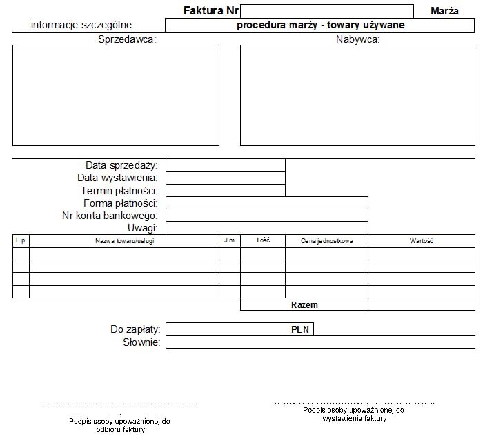
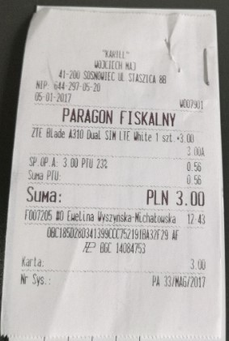
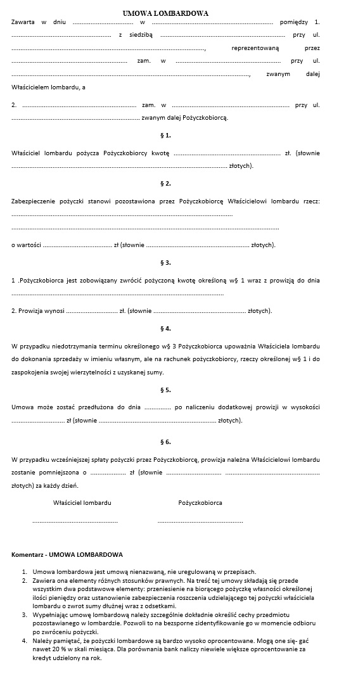

<h1>Inżynieria oprogramowania</h1>

# Spis treści

1. [Zadanie 01](#Zadanie%2001)

# Zadanie 01

## **Grupa**

Wtorek, 15:30-17:00

## **Zespół** 
- Jarosław Buszowiecki (*Kierownik*)
- Bartosz Adamczuk
- Paweł Biernacki
- Mateusz Dzikielewski

**Kontakt e-mail**	[lombard2019IOpr@gmail.com](mailto:lombard2019IOpr@gmail.com)

## Konspekt

**Temat**: *Lombard. Życie pod zastaw.*

Działalność polegająca na handlu przedmiotami kupionymi od klientów lub udzielaniu pożyczek pod zastaw.

**Opis tematu**: 

Na najwyższym szczeblu organizacyjnym znajduje się Właściciel Firmy. Właściciel zajmuje się delegacją Pracowników do konkretnych Oddziałów Firmy. W każdym Oddziale wyznaczony Pracownik pełni funkcję Kierownika. W każdym Oddziale jest tylko Pracownik oraz Kasjer.

**Uzasadnienie**: 

Wdrożenie projektu umożliwi łatwiejszą indeksację posiadanych towarów w Oddziałach. Umożliwi też łatwą weryfikację Klientów między Oddziałami oraz kontrolę aktualnych Dłużników.

**Cele**: 

- łatwe zarządzanie zastawionym towarem;
- walidacja Klientów;
- zarządzanie Dłużnikami;
- kontrola działań Oddziałów przez Właściciela;

**Zakres**: 
- stworzenie systemu umożliwiającego zarządzanie ww. Cechami

**Narzędzia**:

- C# (*REST API*)
- React / Node (*Frontend*)
- PSQL / MySQL (*DataBase*)
- VS2017 / Rider / VSCode (*IDE*)

**Bibliografia**:

*brak*

## **Opis "*biznesowy sytuacji w temacie*"**

Każdy dzień pracujący w Lombardzie zaczyna się o godzinie 8:00. Pracownicy przychodzą do pracy 15 minut przed rozpoczęciem godzin otwarcia Oddziału. Pracownicy są odpowiedzialni za obsługę Oddziału. Do Oddziału Firmy przychodzą Klienci. Są cztery możliwe scenariusze interakcji między Klientem a Kasjerem Oddziału. Pierwszy scenariusz jest wtedy gdy Klient przychodzi *Zastawić* Towar. W takim przypadku Towar jest przyjmowany na stan Oddziału, Kasjer na bazie własnej wiedzy oraz możliwej wiedzy osób trzecich (tj. *Rzeczoznawców*) wycenia dany towar. Wartość przyjęcia towaru jest odpowiednio niższa niż jego rzeczywista wartość. Minimalna niezbędna ilość informacji (zgodnie z dyrektywą RODO) umożliwiająca identyfikację Klienta jest wprowadzana do *Rejestrów*. W *Rejestrze* przechowywane są dane Klienta, informacje o *Zastawionym* Towarze oraz termin w którym Towar przechodzi na własność Oddziału. Drugim ze scenariuszy jest wtedy, gdy Klient przychodzi spłacić dany Towar który został Zastawiony nie później niż do ostatniego dnia ustalonego terminu spłaty. W tym przypadku Towar zostaje skreślony z *Rejestru* oraz zostaje on wydany Klientowi. Trzecim wariantem jest niespłacenie Towaru w ustalonym terminie spłaty. W tym przypadku towar zostaje przejęty przez Oddział na poczet długu. Towar w tym momencie zostaje dodany do Towaru na Sprzedaż. Czwartym wariantem następuje wtedy gdy Klient przychodzi zakupić wystawiony wcześniej Towar na Sprzedaż, lecz nie jest on pierwotną osobą która go *Zastawiła*. W takim przypadku Towar jest wykreślany z *Rejestru* Towaru oraz zostaje wydany Klientowi. W ciągu jednego może nastąpić wiele interakcji Kasjera z Klientami. Wszystkie te interakcje są zapisywane w *Rejestrze* i przekazywane w wersji papierowej Właścicielowi przy jego cotygodniowej wizycie. Kierownik jest odpowiedzialny za prowadzenie wyżej wymienionych Rejestrów. Właściciel weryfikuje poprawność *Rejestrów* w swojej głównej siedzibie. Na stan aktualny przekazywanie dokumentacji jest skomplikowane i rozdzielone w czasie. Właściciel nie posiada żadnej kontroli nad posiadanym Towarem przez Oddział do momentu przekazania *Rejestrów*. Właściciel nie posiada żadnej kontroli nad Dłużnikami do momentu przekazania Rejestrów. Oddziały mają utrudnioną komunikację dotyczącą Dłużników oraz posiadanym Towarem. 

**Organizacja** - Lombard

**Otoczenie organizacji** –  Klient, Bank, Firma kurierska, Poczta, US, ZUS

**Interesariusze organizacji** – Właściciel, Kierownik, Kasjer, Klient, Bank, Firma kurierska, Poczta, US, ZUS

**Dziedzina problemowa** - Zarządzanie oddziałami (w tym CRM)

**Interesariusze dziedziny problemowej** – Bank, Klient, Firma kurierska, Poczta, US, ZUS

**Pracownicy biznesowi** – Właściciel, Pracownik

## **Słownik**

**Pracownik** – osoba zatrudniona w Organizacji.

**Kierownik** – Pracownik Oddziału Organizacji odpowiedzialny za prowadzenie Rejestrów.

**Kasjer** – Pracownik Oddziału Organizacji odpowiedzialny za interakcję z Klientami

**Rzeczoznawca** – osoba niezatrudniona w Organizacji mająca wpływ na wycenę Towarów.
**Oddział** – lokalizacja Organizacji poza lokalem głównym

**Towar** (alternatywnie: **Produkt**) – rzecz przeznaczona do sprzedaży

**Rejestr** – spis przeprowadzonych działań w Oddziale w formie papierowej. Zawiera informacje o Produktach, Dłużnikach oraz byłych Klientach. Prowadzi je Kierownik.

# Ćwiczenia 02

1. **Ustalenie celu biznesowego**.
    - Lepsza komunikacja między oddziałami.
2. **Ustalenie celów cząstkowych**.
    - Ułatwienie komunikacji między oddziałami.
    - Szybszy dostęp do informacji o stanie oddziału.
    - Łatwiejsze raportowanie zysków / strat.
3. **Ustalenie jakie przedsięwzięcia (w tym nieinformatyczne) pomogą osiągnąć te cele.**
    - Ułatwienie komunikacji między oddziałami -> Poprzez SI „wiadomości”
    - Szybszy dostęp do informacji o stanie oddziału. -> Poprzez SI „stan-oddziału”
    - Łatwiejsze raportowanie zysków / strat. -> Poprzez SI „raportowanie”
4. **Wybrane cele do realizacji.**
    - Ułatwienie komunikacji między oddziałami -> Poprzez SI „wiadomości”
    - Szybszy dostęp do informacji o stanie oddziału. -> Poprzez SI „stan-oddziału”
    - Łatwiejsze raportowanie zysków / strat. -> Poprzez SI „raportowanie”
5. **Lista sytuacji przykładowych(>=5**).
    1.	Klient zastawia towar w Oddziale.
    2.	Klient sprzedaje towar w Oddziale.
    3.	Klient spłaca towar wcześniej zastawiony w Oddziale.
    4.	Klient przychodzi zapytać się o dostępność towaru.
    5.	Klient chce kupić towar.
    6.	Pracownik chce skomunikować się z innym Oddziałem.
    7.	Pracownik chce zdać dzienny raport Właścicielowi.

6. **Opis sytuacji przykładowych.**

    1) Klient przychodzi do Oddziału w celu zastawienia towaru w sklepie. Kasjer wycenia wartość towaru. W przypadku gdy towar posiada znikomą wartość Kasjer nie przyjmuje towaru. Kierownik wystawia zaświadczenie o przyjęciu towaru pod zastaw.
    2) Klient przychodzi do Oddziału w celu sprzedania towaru w sklepie. Kasjer wycenia wartość towaru. W przypadku gdy towar posiada znikomą wartość, Kasjer nie przyjmuje towaru. W przeciwnym razie, kupuje go. Kierownik wystawia paragon/fakturę.
	3) Klient przychodzi do Oddziału w celu spłaty wcześniej zastawionego towaru. Klient musi posiadać zaświadczenie o wcześniejszym przyjęciu towaru. Klient spłaca towar. Kasjer wydaje towar. Kierownik wystawia zaświadczenie o spłacie zastawu.
	4) Klient przychodzi do Oddziału w celu zapytania o dostępność danego produktu. Kasjer sprawdza w Rejestrze dostępność towaru. Kasjer przedstawia informację Klientowi o dostępności.
	5) Klient przychodzi do Oddziału w celu zakupu danego produktu. Kasjer sprawdza w Rejestrze dostępność towaru. Kasjer przedstawia informację Klientowi o dostępności. W przypadku zgodności obu stron co do ceny, Kasjer wydaje towar, a Klient za niego płaci. Kierownik wydaje paragon/fakturę.
	6) Kierownik chce zapytać inne Oddziały o dostępności danego towaru. Kierownik musi zadzwonić do każdego oddziału z osobna. Każdy Oddział sprawdza ręcznie dostępność i zwraca tą informację Kierownikowi oddziału który dzwonił.
	7) Kierownik pod tygodnia chce przygotowuje raport tygodniowy Oddziału dla Właściciela Firmy. Kierownik musi czekać na przyjazd Właściciela w celu zdania raportu. Właściciel sporządza podsumowanie z działalności Firmy.

7. **Specyfikacja przez przykłady:**
    1) &nbsp;
        - Klient zgłasza chęć zastawienia towaru w sklepie
        - Kasjer wycenia wartość towaru
        - Kasjer przyjmuje towar lub nie przyjmuje go (w zależności od wartości)
        - Kierownik wystawia zaświadczenie o przyjęciu pod zastaw
    2) &nbsp;
        - Klient zgłasza chęć sprzedania towaru w sklepie
        - Kasjer wycenia wartość towaru
        - Kasjer przyjmuje towar lub nie przyjmuje go (w zależności od wartości)
        - Kierownik wystawia paragon/fakturę
    3) &nbsp;
        - Klient zgłasza chęć spłacenia wcześniej zastawionego towaru
        - Kasjer sprawdza czy klient posiada zaświadczenie o wcześniejszym przejęciu towaru
        - Klient pokazuje zaświadczenie o wcześniejszym przejęciu towaru
        - Klient otrzymuje zastawiony towar w przypadku spłacenia zastawu.
    4) &nbsp;
        - Klient pyta o dostępność towaru, który go interesuje
        - Kasjer sprawdza dostępność danego towaru
        - Kasjer przedstawia klientowi informacje o dostępności
    5) &nbsp;
        - Klient zgłasza chęć zakupu danego produktu
        - Kasjer sprawdza dostępność danego produktu
        - Kasjer przedstawia klientowi informacje o dostępności
        - Klient płaci za towar
        - Kasjer wydaje towar
        - Kierownik wydaje paragon/fakturę
    6) &nbsp;
        - Kierownik chce zapytać inne oddziały o dostępność danego towaru
        - Kierownik dzwoni do każdego oddziału z osobna
        - Kierownicy innych oddziałów sprawdzają dostępność danego towaru
        - Kierownik otrzymuje informację zwrotną o dostępności wybranego towaru.
    7) &nbsp;
        - Kierownik przygotowuje raport tygodniowy 
        - Kierownik czeka na przyjazd właściciela
        - Właściciel sporządza podsumowanie z działalności firmy
8. **Lista dokumentów – jeżeli istnieją – ich skany, zdjęcia, jeżeli nie – opis/wygląd formularza, raportu (>=5).** 

*Rys 1: Faktura VAT (dot. sprzedaży towaru)*

*Rys 2: Paragon fiskalny (dot. sprzedaży towaru)*

*Wzór 1. Zaświadczenie o zastawieniu towaru (i udzieleniu pożyczki zwrotnej)*

 |  | 
-------------------------------------------------------------+-------------------------------------------------
 | &nbsp; &nbsp;

| Rodzaj naruszenia | Obowiązek zgłoszenia organowi nadzorczemu | Obowiązek zawiadomienia osoby której dane dotyczą  | Okoliczności naruszenia | Skutki naruszenia | Podjęte działania zaradcze |
|:-:|:-:|:-:|:-:|:-:|:-:|
| &nbsp; | &nbsp; | &nbsp; | &nbsp; | &nbsp; | &nbsp; |
| &nbsp; | &nbsp; | &nbsp; | &nbsp; | &nbsp; | &nbsp; |
| &nbsp; | &nbsp; | &nbsp; | &nbsp; | &nbsp; | &nbsp; |